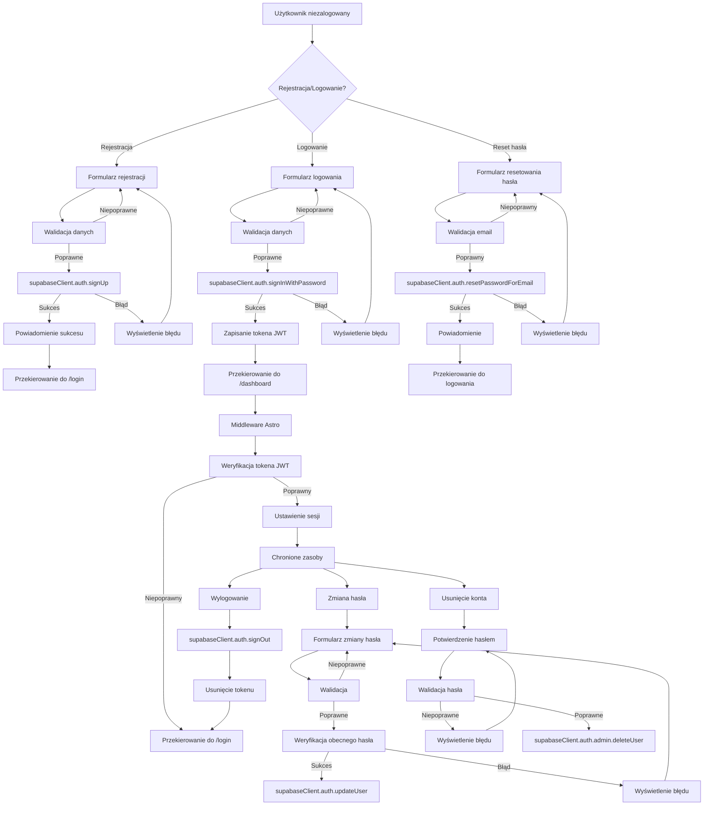

```mermaid
graph TD
    A[Użytkownik niezalogowany] --> B{Rejestracja/Logowanie?}
    B -->|Rejestracja| C[Formularz rejestracji]
    B -->|Logowanie| D[Formularz logowania]
    B -->|Reset hasła| E[Formularz resetowania hasła]
    
    C --> F[Walidacja danych]
    F -->|Niepoprawne| C
    F -->|Poprawne| G[supabaseClient.auth.signUp]
    G -->|Sukces| H[Powiadomienie sukcesu]
    G -->|Błąd| I[Wyświetlenie błędu]
    H --> J[Przekierowanie do /login]
    I --> C

    D --> K[Walidacja danych]
    K -->|Niepoprawne| D
    K -->|Poprawne| L[supabaseClient.auth.signInWithPassword]
    L -->|Sukces| M[Zapisanie tokena JWT]
    L -->|Błąd| N[Wyświetlenie błędu]
    M --> O[Przekierowanie do /dashboard]
    N --> D

    E --> P[Walidacja email]
    P -->|Niepoprawny| E
    P -->|Poprawny| Q[supabaseClient.auth.resetPasswordForEmail]
    Q -->|Sukces| R[Powiadomienie]
    Q -->|Błąd| S[Wyświetlenie błędu]
    R --> T[Przekierowanie do logowania]
    S --> E

    O --> U[Middleware Astro]
    U --> V[Weryfikacja tokena JWT]
    V -->|Poprawny| W[Ustawienie sesji]
    V -->|Niepoprawny| X[Przekierowanie do /login]
    W --> Y[Chronione zasoby]

    Y --> Z[Wylogowanie]
    Z --> AA[supabaseClient.auth.signOut]
    AA --> AB[Usunięcie tokenu]
    AB --> X

    Y --> AC[Zmiana hasła]
    AC --> AD[Formularz zmiany hasła]
    AD --> AE[Walidacja]
    AE -->|Niepoprawne| AD
    AE -->|Poprawne| AF[Weryfikacja obecnego hasła]
    AF -->|Sukces| AG[supabaseClient.auth.updateUser]
    AF -->|Błąd| AH[Wyświetlenie błędu]
    AH --> AD

    Y --> AK[Usunięcie konta]
    AK --> AL[Potwierdzenie hasłem]
    AL --> AM[Walidacja hasła]
    AM -->|Niepoprawne| AN[Wyświetlenie błędu]
    AM -->|Poprawne| AO[supabaseClient.auth.admin.deleteUser]
    AN --> AL
```